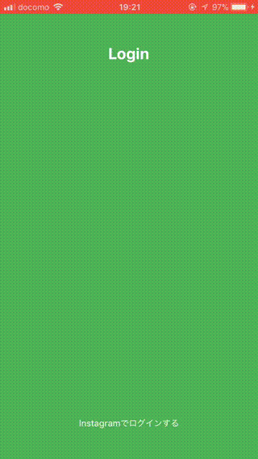

# React-Native-Simple-Instagram
Instagram API client for React Native without `react-native link`.  
This client not use NativeModule, only pure javascript.  
So this don't use `react-native link` and [Expo](https://expo.io) can also easily use Instagram API without auth0 and server.  
  
And also offer login button,so that is easily login Instagram.  
Button is customizable, and including login webview.  
  
Checkout [example](example).

## Installation
```bash
npm install react-native-simple-instagram --save
```

## Features
* Not use NativeModules, only pure javascript
* Simple API client
* Just put a button to login
* Customizable login button
* Compatible with SafeAreaView

## Demo


## TWLoginButton props

| Name | Type| Default | Description |
| --- | --- | --- | --- |
| type | string | TouchableOpacity | TouchableOpacity or TouchableHighlight or TouchableWithoutFeedback |
| children | React.Component |  |  |
| callbackUrl | string(required) | null | Instagram application callback url |
| responseType | string | token | token or code. if responseType === token, requires clientSecret. |
| scope | array | ['basic','public_content'] | check this [document](https://www.instagram.com/developer/authorization/) | 
| headerColor | string | '#f7f7f7' | Webview's modal and SafeAreaView backgroundColor |
| onPress | func | (e) => {} | Called when login button on Press | 
| onGetAccessToken | func | ({oauth_token,oauth_token_secret}) => {} | Called when get access token |
| onClose | func | () => {} | Called when press close button |
| onSuccess | func | (user) => {} | Called when logged in and get user account |
| onError | func | (e) => {} | Called when on error |
| renderHeader | func | (props) => React.Component | If you use original Header Component,use this props |

## Client API

* `intagram.setClientId(client_id,client_secret)` - set application id and secret.
* `intagram.setAccessToken(access_token)` - set user access_token, when you already have access_token.
* `intagram.getLoginUrl(callback_url,response_type,scope)` - get login url for authorize app.
* `intagram.getAccessToken(code)` - if reponse_type = code, you must call this.
* `intagram.api(method,endpoint,parameters)` - call intagram api.
* `intagram.get(endpoint,parameters)` - call intagram get api.
* `intagram.post(endpoint,parameters)` - call intagram post api.

## Other API

* decodeHTMLEntities
```js
import { decodeHTMLEntities } from 'react-native-simple-instagram'

console.log(decodeHTMLEntities("&amp; &apos; &#x27; &#x2F; &#39; &#47; &lt; &gt; &nbsp; &quot;"))
```
Tweet is include htmlencoded characters.  
So this function decode special characters.

* getRelativeTime
```js
import { getRelativeTime } from 'react-native-simple-instagram'

console.log(getRelativeTime(new Date(new Date().getTime() - 32390)))
console.log(getRelativeTime("Thu Apr 06 15:28:43 +0000 2017"))
```
Tweet created_at convert to relative time.
ex) 1s 15m 23h

## Donation
If you like this library, please donate me.  
* BCH -> `qre56em7z47p38rz3wktter2eyaww48qnqmyq4j386`
  
